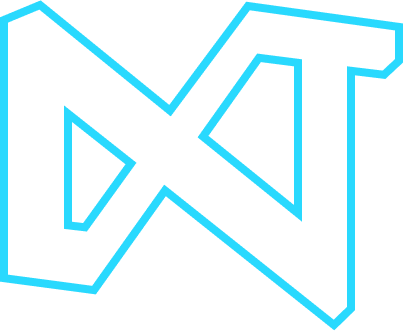

  

  <h2>Resources - Norman Lab</h2>

 

Learning materials, project ideas and much more

Created by <a href="">Next Tech Lab</a>.

    
    
    

## Next Tech Lab

## License

`Norman - Resources` is available under the MIT license. See the LICENSE file for more info.

## Contributing

Please read `Contributing.md` for details on our code of conduct, and the process for submitting pull requests to us.

## Shout outs
The product is build by the following member(s):

| 
 [Abhijeet Jha](https://github.com/abhijeetjha602)
 | 
 [Lakshya Dhariwal](https://github.com/lakshya-dhariwal)
 | 
 [Divyanshu Yadav](https://github.com/divyanshu1810)
 | 
| ---------------------------------------------------------------------------------------------------------------------------------- | ---------------------------------------------------------------------------------------------------------------------------------- | ---------------------------------------------------------------------------------------------------------------------------------- | 
## Forking this repo 🚨

Many people have contacted us asking if they can use this code for their own websites. The answer to that question is usually "yes", with attribution. There are some cases, such as using this code for a business or something that is greater than a personal project, that we may be less comfortable saying yes to. If in doubt, please don't hesitate to ask us.

We value keeping this site open source, but as you all know, _**plagiarism is bad**_. We spent a non-negligible amount of effort developing, designing, and trying to perfect this iteration of our website, and we are proud of it! All we ask is to not claim this effort as your own.

So, feel free to fork this repo. If you do, please just give us proper credit by linking back to our website, {link} . Refer to this handy [quora post](https://www.quora.com/Is-it-bad-to-copy-other-peoples-code) if you're not sure what to do. Thanks!
